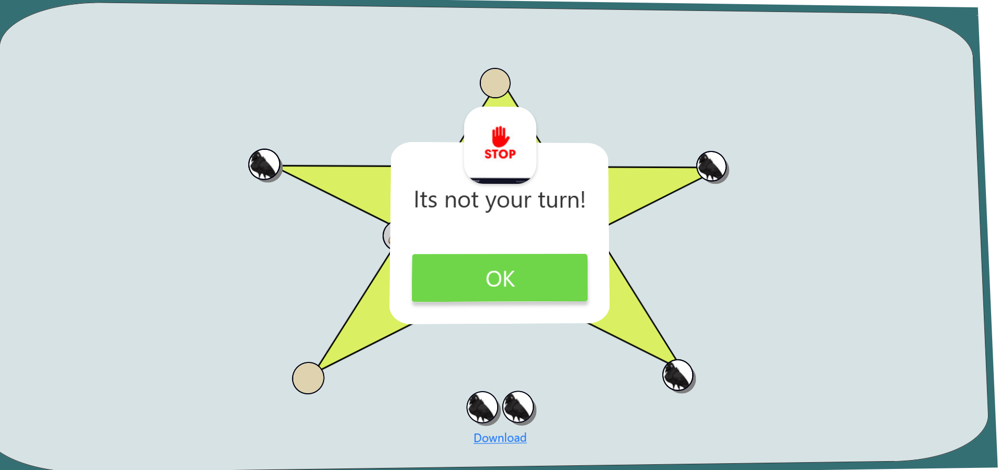

# kaooa-Vulture-game
### Overview

Discover Kaoaa, a traditional game from India, also known as "Vulture and Crows." It's a hunt game where one player with one token faces off against another with multiple tokens. The tokens are named after animals, adding a fun twist. Caw! Caw!

The game uses a unique star-shaped board, and you can easily create your own and customize it.

### Technology

Kaoaa is built with basic HTML, CSS, and JavaScript, making it a great learning experience for JavaScript handling.

### Error Handling

The game's code focuses on handling errors effectively, ensuring smooth gameplay without unexpected issues.

### Download Log Feature

You can download a log file during the game to review and analyze your moves later.

### How to Play Kaoaa

#### Objectives

- **Crows:** Surround the vulture and block it.
- **Vulture:** Capture four crows by jumping over them.

#### Setup

To play, you need a star-shaped game board, a vulture token, and seven crow tokens.

#### Gameplay

1. **Crows Go First:** Player 1 places one crow token on any intersection.
2. **Vulture Goes Next:** Player 2 places the vulture token.
3. **Crows Continue "Drop Phase":** Player 1 drops all seven crows strategically.

#### Legal Moves

- **Crows:** Move to an adjacent spot.
- **Vulture:** Move or jump over a crow to capture it.

#### Play Continues

Players take turns, with the vulture capturing crows and the crows blocking the vulture.

#### Winning

- **Vulture Wins:** Capture at least four crows.
- **Crows Win:** Block the vulture.

### Screenshot

.png)

.png)

